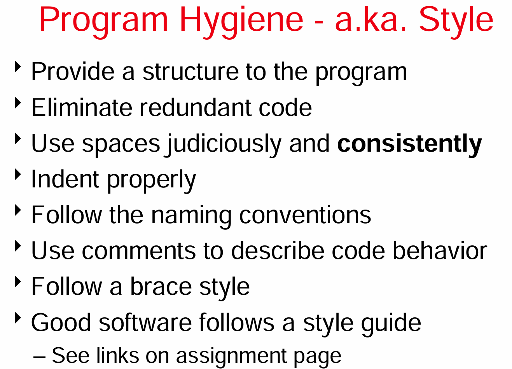
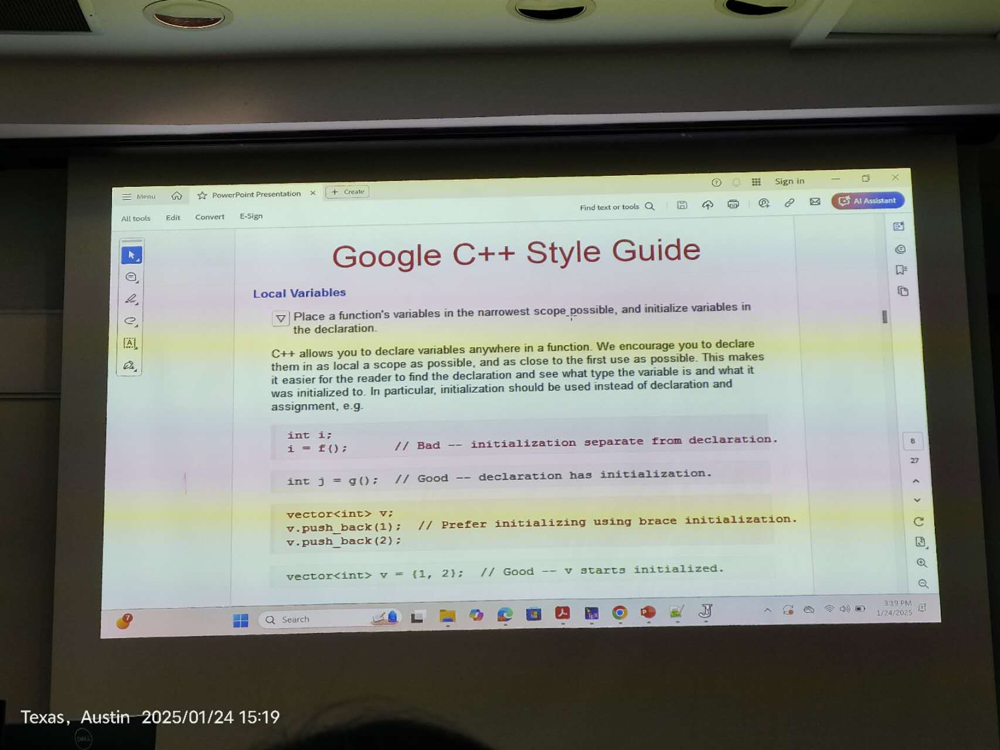
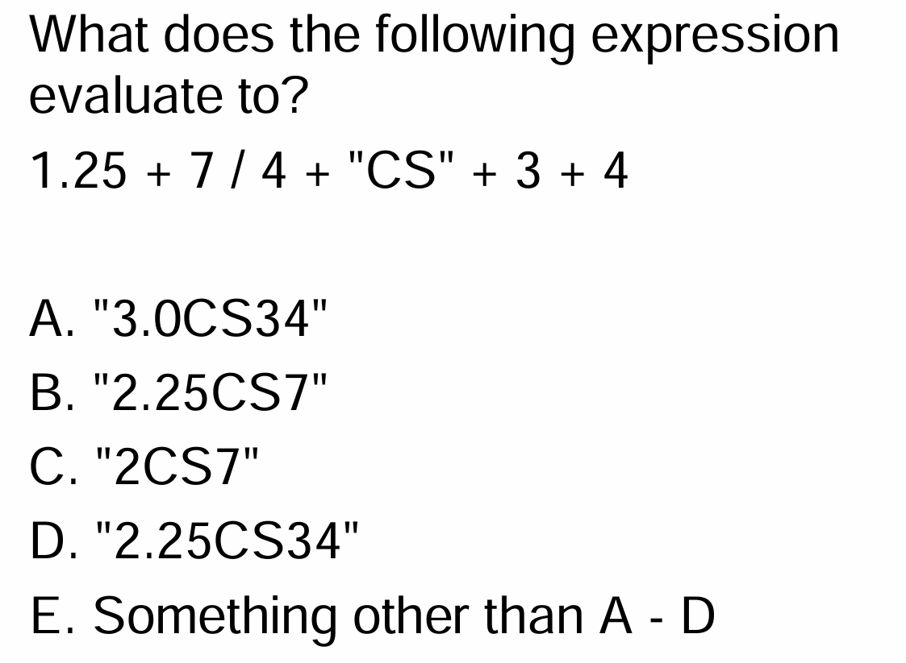

# Intro
Jordan UT博士

10,000 tuiton a year
博士生免学费，每月2000dollars补助，包工作

# class1-1.23
{ curly braces
[ square brackets
( parenthesis

命令行编译运行：
javac HelloWorld.java
java HelloWorld

compiler: C
high level language to lower
more efficient
optimize
intepreter: python
Two-Phases-of-compilation:
program-(compiles) - byte code- (JVM interpreter) - machine code
compile once and run many -- **Write once, run anywhere.**
字节码是平台/机器无关的

case-snesitive 区分大小写，所以Void上一个合法类名
区分string和char（python不区分）
CamelCase：驼峰命名法
escape sequence：转义序列【如\"  \\  \n  \t】【"\\\\"实际输出"\\"】
backslash: \
doublequote: "

# presentation
## ppt
10min 2min/人
下周四/五 周四准备好
严格计时

选择简单的主题
font 至少24号
避免大段文字，提取关键点关键词，使用短语
引用：网页论文等
不要拿着纸直接读
teach us something
make you look good
practice leads to prefect
1. 标题页
2. outline（motivation\intruduction\details\conclusion\questions）
3. 引用放在最后单独一页

# class3-1.24 static methods and structured programming
Program Hygiene

# class4-1.27
**coupling and cohesion 耦合 内聚**
类间低耦合 low coupled
类内高内聚 high cohesive
refactoring 重构: changing the structure of the code without changing its functionality

**Statically typed languages**
java 静态类型语言
python 动态类型语言 dynamically typed language

primitive types 内置类型/原始类型
decimal 小数
decimal points 小数点

**PEMDAS**
the math order of operations:
1 - Parentheses
2 - Exponents and Roots
3 - Multiplication
4 - Division
5 - Addition
6 - Subtraction

D

Declaration
Initialization

# final
## A-1
## A-2
requirements 需求
具体明确
如交互界面精确到长宽、颜色，接受什么输入，回复速度在几秒之内
## A-3 prototype原型
画、